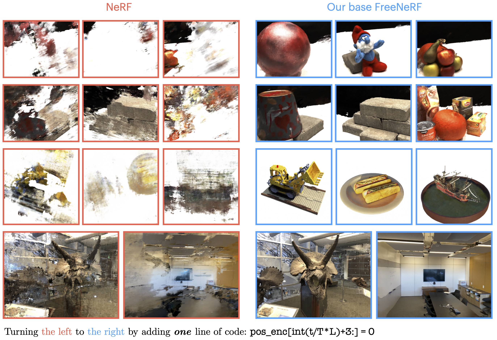

# [CVPR23] FreeNeRF: Improving Few-shot Neural Rendering with Free Frequency Regularization

## [Project Page](https://jiawei-yang.github.io/FreeNeRF/) | [Paper](TBA)

This repository contains the code release for the CVPR 2023 project
> [**FreeNeRF: Improving Few-shot Neural Rendering with Free Frequency Regularization**](TBA),  
> Jiawei Yang, Marco Pavone, and Yue Wang   
> Computer Vision and Pattern Recognition (CVPR), 2023

The code is based on [RegNeRF implementation](https://github.com/google-research/google-research/tree/master/regnerf).



## About FreeNeRF

Novel view synthesis with sparse inputs is a challenging problem for neural radiance fields (NeRF). Recent efforts alleviate this challenge by introducing external supervision, such as pre-trained models and extra depth signals, and by non-trivial patch-based rendering. In this paper, we present Frequency regularized NeRF (FreeNeRF), a surprisingly simple baseline that outperforms previous methods with minimal modifications to the plain NeRF. We analyze the key challenges in few-shot neural rendering and find that frequency plays an important role in NeRF's training. Based on the analysis, we propose two regularization terms. One is to regularize the frequency range of NeRF's inputs, while the other is to penalize the near-camera density fields. Both techniques are ``free lunches'' at no additional computational cost. We demonstrate that even with one line of code change, the original NeRF can achieve similar performance as other complicated methods in the few-shot setting. FreeNeRF achieves state-of-the-art performance across diverse datasets, including Blender, DTU, and LLFF. We hope this simple baseline will motivate a rethinking of the fundamental role of frequency in NeRF's training under the low-data regime and beyond.

**TL;DR:** We use frequency regularization and occlusion regularization to improve few-shot neural rendering. Both techniques can be implemented with a few lines of code.

## Installation

We recommend to use [Anaconda](https://www.anaconda.com/products/individual) to set up the environment. First, create a new `freenerf` environment: 

```conda create -n freenerf python=3.6.15```

Next, activate the environment:

```conda activate freenerf```

You can then install the dependencies:

```pip install -r requirements.txt```

Finally, install jaxlib with the correct CUDA version. For example, if you have CUDA 11.0 installed, you can run
```
pip install --upgrade pip
pip install --upgrade jaxlib==0.1.68+cuda110 -f https://storage.googleapis.com/jax-releases/jax_cuda_releases.html
```

## Data
Please follow RegNeRF's [data preparation instructions](https://github.com/google-research/google-research/tree/master/regnerf) to prepare the DTU and LLFF datasets.

## Running the code

### Training an new model

For training a new model from scratch, you need to first need to define your CUDA devices. For example, when having access to 8 GPUs, you can run

```export CUDA_VISIBLE_DEVICES=0,1,2,3```

and then you can start the training process by calling

```python train.py --gin_configs configs/{CONFIG} ```

where you replace `{CONFIG}` with the config you want to use. 

We provide the config files for FreeNeRF, RegNeRF, and our direct baseline mipNeRF in the `configs` folder.In the config files, you might need to adjust the `Config.data_dir` argument pointing to your dataset location. For the DTU dataset, you might further need to adjust the `Config.dtu_mask_path` argument. The `*_bl.gin` configs are the mip-NeRF baseline configurations.

We provide the `wandb` interface for logging. You might need to install `wandb` and change the the wandb settings in `inter/configs.py` to fit your own wandb account. 
### Rendering test images

You can render and evaluate test images by running

```python eval.py --gin_configs configs/{CONFIG} ```

where you replace `{CONFIG}` with the config you want to use. Similarly, you can render a camera trajectory (which we used for our videos) by running

```python render.py --gin_configs configs/{CONFIG} ```

## Reproducing the results

Our results are obtained on 4 NVIDIA A40 GPUs. The results can be slightly different across different runs due to the randomness in the training process. For example, in the DTU dataset, we can obtain a PSNR of 20.21 dB under the 3-shot setting, compared to 19.92 dB in the paper.

- [ ] We will release the pre-trained models soon.

## Citation

If you find our work useful, please cite it as
```
@InProceedings{Yang2023FreeNeRF,
    author    = {Jiawei Yang and Marco Pavone and Yue Wang},},  
    title     = {FreeNeRF: Improving Few-shot Neural Rendering with Free Frequency Regularization},
    booktitle = {Proc. IEEE Conf. on Computer Vision and Pattern Recognition (CVPR)},
    year      = {2023},
}
```